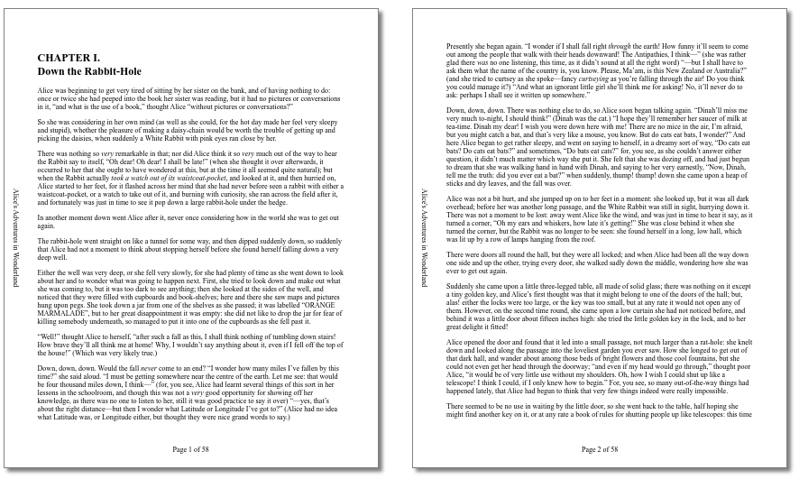
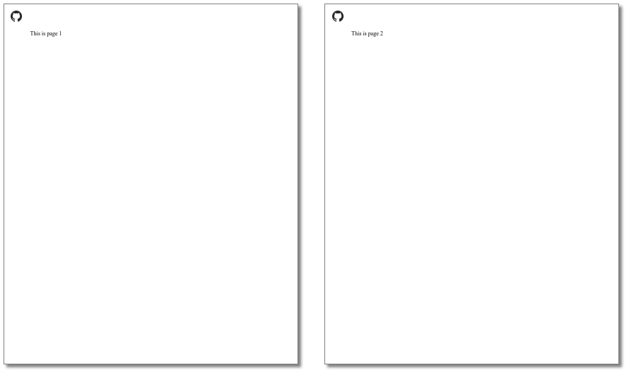

# @page margin boxes

Morten Stenshorne \<mstensho@chromium.org\>, October and November 2023.

Spec: https://www.w3.org/TR/css-page-3/#margin-boxes

## Introduction

Page margin boxes can be defined in paged media (such as printing or when generating PDFs) by authors, to define content outside the page area, i.e. in the margin area. This is the area where the browser normally puts headers and footers (which typically may include the document title, URL, time stamp, page number and total number of pages), if enabled. @page margin boxes enables an author to customize this part of the page - not just at the top and at the bottom, but also on the left and right sides, as well as in the corners. The spec defines 16 margin areas - 4 corners, and 3 parts (beginning, middle, end) on each of the 4 sides. Each area is defined via an @-rule nested inside an @page rule.

See the figure at https://www.w3.org/TR/css-page-3/#page-model


## Motivation

One of the most interesting use cases for this is for authors to specify their own headers and footers, including page numbering; see https://www.w3.org/TR/css-page-3/#page-based-counters

Currently, no web browser is known to support this, but it is supported by the Prince XML PDF generator.
On that note: Many PDF screenshots in this document are captured using the Prince XML evaluation copy, which places its own logo in the top right corner of the first page.

```html
<!DOCTYPE html>
<style>
  @page {
    @top-center {
      content: "Page " counter(page) " of " counter(pages);
    }
    @left-middle {
      writing-mode: vertical-lr;
      content: "Alice's Adventures in Wonderland";
      margin-left: 1em;
    }
  }
</style>
<h2><a id="chap01"></a>CHAPTER I.<br>
Down the Rabbit-Hole</h2>
<p>
Alice was beginning to get very tired of sitting by her sister on the bank, and
of having nothing to do: once or twice she had peeped into the book her sister
was reading, but it had no pictures or conversations in it, “and what is
the use of a book,” thought Alice “without pictures or
conversations?”
</p>
<p>
So she was considering in her own mind (as well as she could, for the hot day
[...]
```

   

Another use case: place a logo in the corner on every page:

```
<!DOCTYPE html>
<style>
  @page {
    @top-left-corner {
      content: url(https://github.githubassets.com/favicons/favicon.png);
    }
  }
</style>
<div style="break-after:page;">This is page 1</div>
<div style="break-after:page;">This is page 2</div>
```



## The work to be done

This is about implementing chapter 6 of the CSS Paged Media Module Level 3 specification: https://www.w3.org/TR/css-page-3/#page-properties

This includes supporting @page properties. A page may e.g. specify a border, or a font. The @page rule defines a so-called *page context*. Each page has its own page context, which inherits CSS properties from the HTML root element. Margin at-rules (such as e.g. @top-center) inside an @page rule establish a *margin context*, which inherits CSS properties from the page context. CSS counters also need to work when used, incremented, set or defined in page and margin contexts. This includes the special counters named 'page' (current page number) and 'pages' (total number of pages), which are defined here: https://www.w3.org/TR/css-page/#page-based-counters

Note that page or page margin properties are not inherited by the elements in the document (for instance, setting the font in @page doesn't affect elements in the document, but it is inherited by margin contexts).

```html
<style>
  html {
    color: blue;
  }
  @page {
    border: solid; /* blue */
    padding: 1em;

    @top-center {
      color: hotpink;
      content: "This is hotpink.";
    }

    @bottom-center {
      content: "This is blue.";
    }
  }
</style>
<div>This is blue.</div>
```

However, elements in the document may access the counters set in these contexts, so that if we have a DIV somewhere on an arbitrary page, and the style is

```css
div::before {
  content: "This is page " counter(page) " of " counter(pages) ". ";
}
```
... it will generate the current page number and the total number of pages.

## Concerns

### Predefined counter names

The spec defines the counter names 'page' and 'pages'. Both are accessible by the document's contents, so that any element may use the counters to tell the current page number, or the total number of pages. Documents that use these counter names without being aware of this feature may be in for a surprise. Furthermore, the 'pages' counter is defined as read-only.

### Unprintable area

Most printers have an area on each side near the paper edge which is unprintable, usually due to the paper handling mechanics of the device. These areas are not exposed to CSS in any way. Instead, the browser usually makes sure that the default margins are large enough to avoid this area for the page area (and with any luck, fit the browser-generated headers and footers in the margin area).

However, by making the entire page box (i.e. including the margins) available to the author, the author has no way of reliably avoiding the unprintable area. With this limitation, when printing the page, we're left with the following options:
* Allow the margins' contents to end up being clipped by the unprintable area
* The author to be conservative about how close to the paper edge margin content is placed
* The page to be scaled down to fit everything, including the margin boxes, within the actual printable area. This will in turn make things smaller than it was supposed to be, so that a centimeter is no longer a centimeter, but something slightly less.

### Custom headless headers / footers?

### Headers and footers generated by the user agent

Most browsers offer to generate some default headers and footers, and they are usually enabled by default. If the document has margin at-rules, they may conflict. A good default behavior may be to suppress user agent generated headers if the document has any margin box rules for at least one of the pages. But this should be configurable. In the UI, instead of simply being able to toggle headers / footers on and off, the browser may want to offer the following options for headers / footers:

* off
* on (as described above; suppress user agent headers if there are margin box at-rules)
* user agent headers / footers only
* author headers / footers only

### CSSOM
