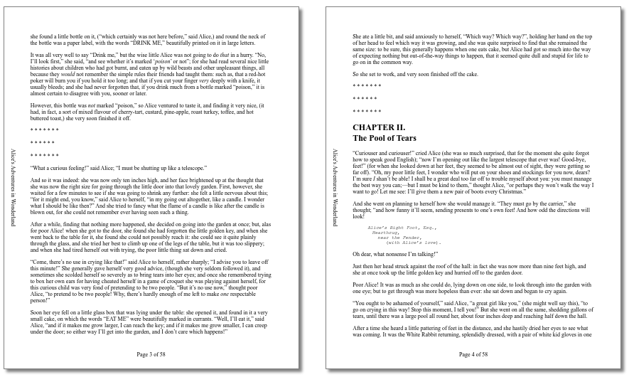

# page-margin-boxes

Spec: https://www.w3.org/TR/css-page-3/#margin-boxes

Page margin boxes can be used by authors to define content on the outside of the page area, i.e. in the margin area.

See the figure at https://www.w3.org/TR/css-page-3/#page-model


The most interesting use case for this is for authors to specify their own headers and footers, including page numbering; see https://www.w3.org/TR/css-page-3/#page-based-counters

Currently, no web browser is known to support this, but it is supported by the Prince XML PDF generator.

```html
<!DOCTYPE html>
<style>
  @page {
    @top-center {
      content: "Page " counter(page) " of " counter(pages);
    }
    @left-middle {
      writing-mode: vertical-lr;
      content: "Alice's Adventures in Wonderland";
      margin-left: 1em;
    }
  }
</style>
<h2><a id="chap01"></a>CHAPTER I.<br>
Down the Rabbit-Hole</h2>
<p>
Alice was beginning to get very tired of sitting by her sister on the bank, and
of having nothing to do: once or twice she had peeped into the book her sister
was reading, but it had no pictures or conversations in it, “and what is
the use of a book,” thought Alice “without pictures or
conversations?”
</p>
<p>
So she was considering in her own mind (as well as she could, for the hot day
[...]
```

   
